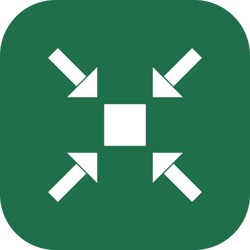
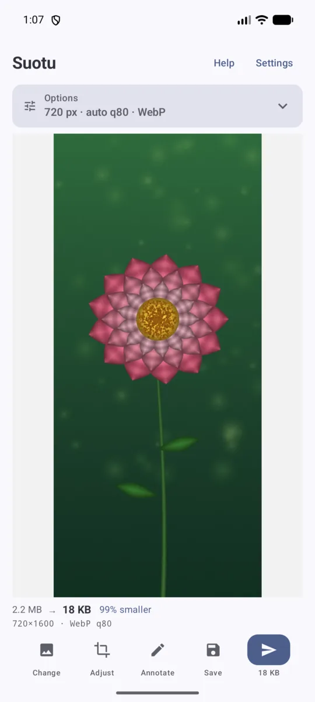
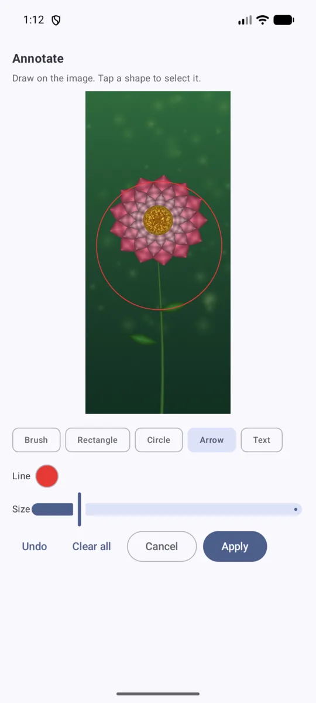

<p align="center">
  
</p>

<h1 align="center">缩图 Suotu</h1>

<p align="center">
  Shrink Android screenshots and photos before sharing them to WeChat / Telegram.
</p>

Replaces the manual loop of *crop → resize to ~40% → nudge JPEG quality until the file
is small but the text still reads* with a couple of taps, choosing the settings from
measurement rather than guesswork.

<p align="center">
  
  &nbsp;&nbsp;
  
</p>

<p align="center">
  <em>Left: 2.2 MB → 18 KB, 99% smaller, format chosen automatically.
  Right: annotating before sending.</em>
</p>

## Flow

1. Take a screenshot.
2. Open Suotu — the newest screenshot loads automatically — or use **Share → Suotu**.
3. Optionally draw on the preview to crop, or annotate.
4. Tap **Send** and pick the app, or **Save** to keep a copy.

## The main screen

The preview gets the space, because the image is what you are judging. Width, quality
and format live in a collapsed **Options** card whose header states the settings in
force (e.g. `540 px · auto q80 · Auto`), so nothing is hidden — only folded. It starts
expanded when there is no image yet and folds once one loads.

Actions are fixed-size icons, so a long translation cannot squeeze them: **Change**,
**Adjust** (crop), **Annotate**, **Save**, **Send**.

## How it decides

**Width** is targeted in absolute pixels, not as a percentage. Readability depends on
the pixel height of the glyphs, so a fixed 40% is far too aggressive for a full
1260px-wide capture and meaningless for a small crop. The slider spans 320–1440px with
quick-jump buttons at the measured widths:

| Width | Use for |
|-------|---------|
| 400px | no small text at all — a photo, a headline, a QR code |
| 540px | big text, photos |
| 720px | **default** — safe for full screenshots |
| 960px | dense text, code, tables |
| 1200px | keep the pixels; shrink only the bytes |

**Quality** is automatic by default: binary-searched over 6 steps to land just under a
byte budget, for both WebP and JPEG, keeping the better result. The chosen value is
shown (`auto q80`) rather than left a mystery, and a slider overrides it — see the
caveat under *Why those numbers*.

**Format** offers `Auto`, `WebP` and `JPG`. Auto encodes both and keeps the **smaller
file**, and then names what it chose — the chip reads `Auto · WebP` — so the outcome is
visible without reading the stats line.

Auto compares *sizes*, not quality numbers. An earlier version preferred the higher
quality number among candidates that fit the budget, which contradicted its own label
and was not meaningful anyway: WebP q80 and JPEG q80 are different codecs' scales.

## Cropping

Two ways, because they suit different intents:

- **Draw on the preview.** Sketch any shape and the minimal enclosing rectangle becomes
  the crop, with a live dashed rectangle showing the result before you lift your finger.
  A tap still opens the fullscreen viewer.
- **Adjust.** A handle-based editor for precise work.

Drawing again composes with the existing crop rather than replacing it, so you can
narrow down repeatedly. **Whole image** clears the selection and appears only when there
is something to clear.

## Annotation

Behind an explicit **Annotate** button, so it never competes with the width slider or
cropping for reach. Tools: brush, rectangle, circle, arrow and text, with adjustable
thickness.

Rectangles and circles carry a **stroke colour and a fill colour**, either of which may
be transparent — so one shape covers an outline, a solid block, or both. Colours come
from a full HSV picker with an alpha strip, the common presets as a top row, and an
explicit *none*.

**Blur is a paint, not a tool.** Select it wherever a colour is offered and every shape
gains it: the brush paints a blurred smear, a circle blurs an oval, a rectangle blurs a
region. It is a real separable Gaussian, radius from the thickness slider (roughly
4–44px on a 1260px-wide image).

Annotations are objects, not pixels: **Undo** removes the last shape, and tapping a
shape selects it for removal. They are applied to the full-resolution image *before*
cropping and scaling, so strokes stay crisp and proportionate at any output width.

> **Blur is an effect, not a redaction.** A Gaussian blur is smooth and
> information-preserving, so it is partially invertible in principle. For genuinely
> private content use an **opaque filled shape**, which discards the pixels outright.

## Saving and sending

- **Send** hands the result to another app through a `FileProvider`.
- **Save** offers *Overwrite original* or *Save as new* (into the `Suotu` album).
  Overwriting is irreversible, so it always confirms, and it is behind this menu rather
  than being its own button next to Send.

When overwriting, the file name follows the actual format — writing WebP bytes into a
`.jpg` would leave a file whose extension lies about its contents — and the dialog warns
when the name will change. Android 10+ requires user consent to modify media the app did
not create, which is surfaced and the write retried.

## Watch rules (configurable)

Two **independent** lists of `(folder, filename regex)` rules, because the folders worth
shrinking unattended are not the folders worth offering on demand:

| | Folders to watch | Folders to offer |
|---|---|---|
| When | Silently, in the background | When you open the app |
| Default | `Pictures/Screenshots` only | Screenshots **and** `DCIM/Camera` |
| Why | Every match is shrunk without asking — you do not want a small copy of every photo you take | Nothing is written unless you tap Send, so a wider net is harmless |

Folder matching is by **prefix**, so `DCIM` also covers `DCIM/Camera`. The regex is
matched against the **file name** only, and an invalid one is flagged in the editor
rather than silently matching nothing. A **Test** button shows which names in the folder
match.

Background detection is event-based — a `JobScheduler` content trigger on MediaStore, so
nothing polls while you are idle. Off by default.

### Opening behaviour

On launch the app looks for the newest image matching the *offer* rules:

- Newer than the threshold (default **60s**, configurable) → loaded automatically.
- Otherwise → an **Open an image** button (system picker, needs no permission).

### Not eating its own output

The watcher is woken by gallery changes and also writes to the gallery, so a broad rule
like `Pictures` + any image would otherwise shrink its own result forever. Three guards
prevent that, verified by `tools/test_rule_matching.py`:

1. Anything under the `Suotu` album is rejected outright.
2. Any name containing `_small` is rejected.
3. A per-name dedup memory stops repeat triggers for the same file.

## Why those numbers

They come from measurement, not taste. The scripts in `tools/` render text at known
sizes, scale and encode it, then OCR the result and score it against the ground truth.
Findings:

- **Text stays legible down to roughly a 10px glyph height**, then degrades quickly.
- **The smallest text in the shot is what binds.** On a 1260-wide phone screenshot
  captions run ~22px, giving a floor near `1260 × (10/22) ≈ 570px`. Hence 720px as the
  safe default.
- **Quality barely matters for UI text.** WebP q40 and q90 both scored 100% OCR
  accuracy, but q90 cost ~70% more bytes. The automatic search is therefore capped at
  80 — otherwise "maximise quality within the budget" would always ship wasted bytes.
  *This result does not generalise to photographs*, where higher quality is visibly
  better, which is why the manual override exists.
- **WebP is roughly half the size of JPEG** at equal legibility, so `Auto` normally
  picks WebP.

Reproduce:

```bash
python3 tools/validate_presets.py          # size per preset, per format
python3 tools/readability_sweep.py         # OCR accuracy across width × quality
python3 tools/threshold_sweep.py           # where small text actually breaks
python3 tools/test_rule_matching.py        # watch-rule matching + anti-loop guards
python3 tools/test_crop_geometry.py        # crop hit-testing: symmetric grab zones
python3 tools/test_crop_layout.py          # crop action row stays on screen
python3 tools/test_lasso_mapping.py        # letterbox-aware touch mapping
python3 tools/test_replace_naming.py       # extension follows the encoded format
python3 tools/test_annotation_geometry.py  # arrowheads + shape hit-testing
python3 tools/test_color_picker.py         # HSV conversion, alpha, transparency
python3 tools/test_gaussian_blur.py        # kernel, separability, edge clamping
python3 tools/test_blur_sampling.py        # blur samples from under the shape
python3 tools/test_blur_perf_model.py      # per-frame drag cost stays constant
python3 tools/test_auto_format.py          # Auto picks the smaller file
python3 tools/test_settings_consistency.py # watcher and UI honour the same settings
```

Several of these exist because they caught a real bug — the crop grab zone being
asymmetric, blur sampling from the wrong place, the mosaic leaving glyph edges readable.
Each keeps a note of what it is defending against.

## Caveat worth knowing

WeChat re-compresses images on send unless you tick **原图 / original**. The wins here
are therefore your *storage*, your *upload data*, and a predictable result — not
necessarily the recipient's download size. Send as a file to preserve it exactly.

## Build

Requires JDK 17+ and the Android SDK (`compileSdk` 37). Point `local.properties` at your
SDK, or set `ANDROID_HOME`:

```bash
echo "sdk.dir=$HOME/Android/Sdk" > local.properties

./gradlew :app:assembleRelease    # minified, signed with the debug key
./gradlew :app:assembleDebug      # unminified
```

Install:

```bash
adb install -r app/build/outputs/apk/release/app-release.apk
```

The release build is signed with the standard Android **debug** key so it is directly
installable without provisioning a keystore. Replace `signingConfig` in
`app/build.gradle.kts` before distributing it anywhere real.

Notes:

- **AGP 9 has built-in Kotlin support.** Applying `org.jetbrains.kotlin.android`
  alongside it fails with *"extension with name 'kotlin' already registered"*. Only
  `com.android.application` + `org.jetbrains.kotlin.plugin.compose` are applied.
- `apksigner` needs `java` on `PATH` or it fails silently with no output.
- On vivo devices `adb install` shows a 安全守护 dialog that must be confirmed on the
  phone; it is auto-rejected if the screen is asleep, which surfaces as
  `INSTALL_FAILED_ABORTED: User rejected permissions`.

## Layout

```
app/src/main/java/com/xudong/suotu/
  ShrinkActivity.kt        main screen: entry paths, preview, actions
  OptionsSection.kt        collapsed width / quality / format card
  IconAction.kt            fixed-size action bar items
  ShrinkEngine.kt          decode → annotate → crop → scale → quality search → encode
  Preset.kt                measured width presets, format policy
  Settings.kt              persisted preferences
  CropRect.kt              normalised crop rect, width range
  CropEditor.kt            handle-based crop editor
  LassoSelect.kt           draw-to-select, letterbox-aware coordinate mapping
  Annotation.kt            annotation model and hit-testing
  AnnotationEditor.kt      annotation UI
  AnnotationRenderer.kt    one renderer for preview and final bitmap
  GaussianBlur.kt          separable Gaussian, written by hand (see the file for why)
  ColorPicker.kt           HSV picker with alpha, transparency and blur paint
  FullscreenPreview.kt     pinch-zoom viewer
  OriginalReplacer.kt      in-place overwrite, incl. the Android 10+ consent flow
  MediaStoreSaver.kt       save-as-new into the Suotu album
  MediaQuery.kt            newest-matching-image lookup
  WatchRule.kt             folder + regex rules
  FolderScanner.kt         folder discovery and regex testing
  ScreenshotWatcherJob.kt  event-driven background shrinking
  BootReceiver.kt          re-arms the watcher after a reboot
  ShrinkNotifier.kt        silent "copy ready" notification
  RuleListEditor.kt        watch-rule list editing
  FolderDialogs.kt         folder picker and regex tester
  HelpActivity.kt          in-app help and About
  SettingsActivity.kt      settings screen
  LocaleManager.kt         manual English / 中文 override
  Theme.kt                 dark mode, Material You dynamic colour
tools/                     the OCR experiments and regression checks
```

## Permissions

None are required for the core flow: sharing an image in, shrinking it, and sharing it
out works with no permissions at all, and output is exposed through a `FileProvider`
scoped to `cache/shared`.

The rest are declared only for opt-in features:

- `READ_MEDIA_IMAGES` — to find your newest screenshot on launch, and for background
  watching. Without it the app offers a system picker instead, which needs no
  permission.
- `READ_EXTERNAL_STORAGE` — the pre-Android 13 equivalent of the above, declared with
  `maxSdkVersion` so it is not requested on newer releases.
- `POST_NOTIFICATIONS` — for the silent "copy ready" notification from the background
  watcher.
- `RECEIVE_BOOT_COMPLETED` — to re-arm the background watcher after a reboot, since a
  scheduled job does not survive one.

There is no network permission, so nothing can leave the device.

## License

MIT — see [LICENSE](LICENSE).
