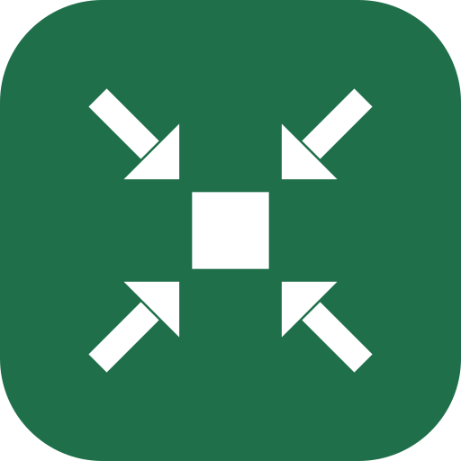
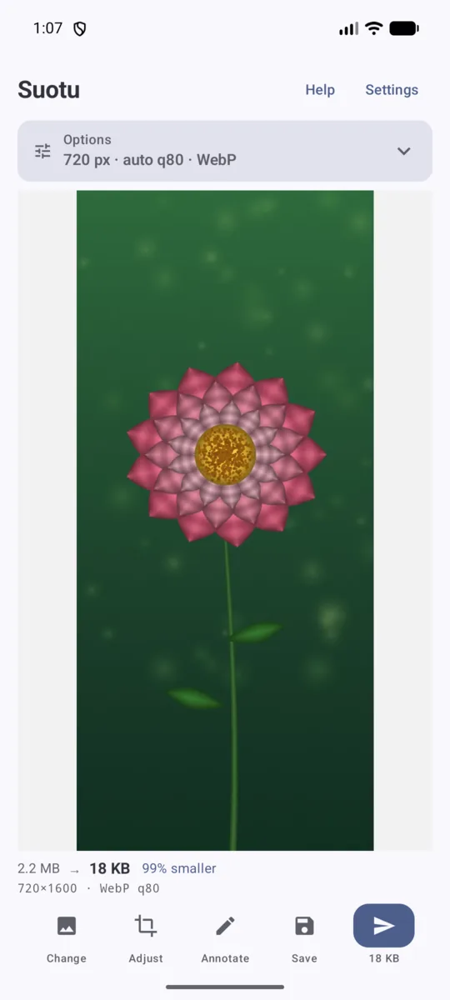
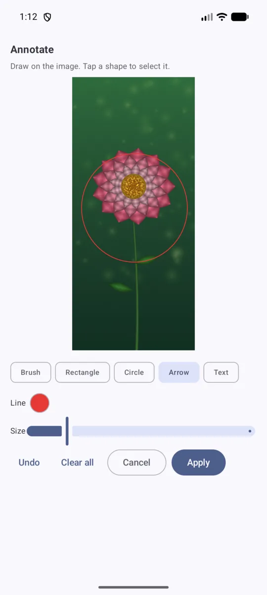

<p align="center">
  
</p>

<h1 align="center">缩图 Suotu</h1>

<p align="center">
  分享截图和照片之前，先把它们变小。<br>
  <a href="README.md">English</a> · <a href="README.zh-CN.md">简体中文</a>
</p>

把「裁切 → 缩到 40% → 反复调 JPEG 质量，直到文件够小但字还看得清」这套手工流程，压缩成
点两下。各项参数来自实测，而不是凭感觉。

<p align="center">
  
  &nbsp;&nbsp;
  
</p>

<p align="center">
  <em>左：2.2 MB → 18 KB，小了 99%，格式自动选择。<br>
  右：发送前先标注。</em>
</p>

## 使用流程

1. 截个图。
2. 打开缩图 —— 最新一张截图会自动载入；也可以在任意相册或文件管理器里用
   **分享 → 缩图**。
3. 可选：在预览上画框裁切，或添加标注。
4. 点 **发送** 选一个应用，或点 **保存** 留一份。

缩图注册为系统分享目标，因此可以从任何应用接收图片，也可以发送到任何应用，不限定某个
聊天软件。

## 主界面

预览占大部分空间，因为要判断的本来就是图。宽度、质量和格式收在一张可折叠的
**选项**卡片里，卡片标题直接写着当前生效的设置（例如 `540 px · 自动 q80 · 自动 · WebP`），
所以只是折叠，不是隐藏。没有图片时会默认展开，载入图片后自动收起。

底部按钮是固定尺寸的图标，所以翻译再长也不会把按钮挤变形：**更换**、**调整**（裁切）、
**标注**、**保存**、**发送**。

## 它如何做决定

**宽度**用绝对像素，而不是百分比。清晰度取决于字形的像素高度，所以固定缩到 40% 对一张
1260px 宽的整屏截图来说太狠，对一张小图裁切又毫无意义。滑杆范围 320–1440px，并给出实测
得出的快捷宽度：

| 宽度 | 适用 |
|-------|---------|
| 400px | 完全没有小字 —— 照片、大标题、二维码 |
| 540px | 大字 / 照片 |
| 720px | **默认** —— 整屏截图的安全值 |
| 960px | 密集文字 / 代码 / 表格 |
| 1200px | 几乎不缩像素，只减体积 |

**质量**默认自动：对 WebP 和 JPEG 各做 6 步二分查找，压到字节预算之内，取更好的那个。选中
的质量值会显示出来（`auto q80`），而不是留个谜；滑杆可以手动覆盖 —— 注意事项见
《为什么是这些数字》。

**格式**提供 `自动`、`WebP` 和 `JPG`。自动会两种都编码，**留更小的那个**，并直接告诉你它选了
什么 —— 芯片上显示 `自动 · WebP`，不用去看下面的统计行。

自动比的是**文件大小**，不是质量数字。早先的版本会在都符合预算的候选里挑质量数字更高的，
这既和它自己的标签矛盾，也本来就没意义：WebP 的 q80 和 JPEG 的 q80 是两套不同的标尺。

## 裁切

两种方式，对应两种意图：

- **在预览上直接画。** 随手画个形状，最小外接矩形就是裁切范围，手指还没抬起时就有虚线框
  实时显示结果。轻点仍然是打开全屏查看。
- **调整。** 带手柄的编辑器，适合精细操作。

再次画会与已有裁切**叠加**而不是替换，所以可以一层层收窄。**整张图**用来清除选择，只在确实
有东西可清时才出现。

## 标注

放在明确的 **标注** 按钮后面，这样它不会和宽度滑杆或裁切抢位置。工具：画笔、矩形、圆形、
箭头、文字，粗细可调。

矩形和圆形有**线条颜色和填充颜色**两个选择，两者都可以设为透明 —— 所以同一个形状既能画
空心框、也能涂实心块，或者两者兼有。颜色来自完整的 HSV 取色器：色相条、透明度条、常用色
快捷一排，以及明确的「无」。

**模糊是一种“颜料”，不是独立工具。** 凡是能选颜色的地方都能选它，于是每个形状都可以是模糊：
画笔画出模糊涂抹，圆形模糊一块椭圆，矩形模糊一片区域。它是真正的可分离高斯模糊，半径由粗细
滑杆控制（1260px 宽的图上约 4–44px）。

标注是对象而不是像素：**撤销**删除最后一个形状，点选某个形状即可删除它。标注作用在**全分辨率
原图**上，且发生在裁切和缩放**之前**，所以不论输出多宽，笔触都保持锐利且比例正确。

有裁切时，标注界面显示的就是**裁切后**的区域 —— 画什么就是发什么。标注本身仍以整图坐标存储，
在最后一步才映射到裁切范围；变的只是视图，输出完全没变。

> **模糊是效果，不是打码。** 高斯模糊是平滑且保留信息的变换，理论上可以被部分还原。真要遮
> 隐私内容，请用**不透明实心形状**，那才是真正丢弃像素。

## 保存与发送

- **发送** 通过 `FileProvider` 把结果交给其他应用。
- **保存** 提供 *覆盖原图* 或 *另存为新图*（存入 `Suotu` 相册）。覆盖不可撤销，所以一定会
  先确认，而且它被放在这个菜单里，而不是直接摆在发送旁边当一个按钮。

覆盖时，文件名会跟着实际格式走 —— 把 WebP 字节写进 `.jpg` 会得到一个后缀说谎的文件 —— 如果
名字要变，对话框会提前说明。Android 10 及以上修改非本应用创建的媒体文件需要用户授权，应用会
弹出授权并在之后重试写入。

## 监听截图

默认关闭。开启后由 MediaStore 事件唤醒，不做轮询。

有两种行为模式，区别在于**是否会在你没开口的情况下往相册写文件**：

| 模式 | 检测到新截图时 | 适合 |
|---|---|---|
| **立即缩小**（默认） | 直接把小图写进相册，并通知你可以发送 | 你截的图大多会发出去 |
| **先问我** | 不解码、不编码、不写文件；只发一条带缩略图的通知询问 | 你只发其中一部分 |

在「先问我」模式下，还可以选择点通知后的行为 —— 这是两种不同的意图，而不是口味问题：

| 点击后 | 行为 |
|---|---|
| **直接缩小并分享**（默认） | 缩小后直接跳到分享面板，中间只闪一个小的进度卡片。点下去就已经代表决定了。 |
| **先打开编辑器** | 打开应用处理这张图，可以先裁切或标注，再发送。 |

两种方式都不会先绕到主界面。直接模式下结果写到分享缓存，不进相册：你要的是**发送**这张图，
而不是再留一份。

两条通知都带缩略图，否则通知只说「有图可以缩」，却不说**是哪张图**。「立即缩小」模式显示的是
缩小**之后**的结果，因为那才是点下去要发的东西。

### 监听规则（可配置）

两组**互相独立**的「(文件夹, 文件名正则)」规则，因为适合后台默默处理的文件夹，和适合打开
应用时推荐的文件夹，并不是同一批：

| | 监听文件夹 | 推荐文件夹 |
|---|---|---|
| 时机 | 后台静默 | 打开应用时 |
| 默认 | 仅 `Pictures/Screenshots` | 截图 **以及** `DCIM/Camera` |
| 原因 | 每条命中都会被无声处理 —— 你不会想给拍的每张照片都留一份小图 | 不点发送就不会写任何文件，所以范围放宽也没关系 |

文件夹按**前缀**匹配，所以 `DCIM` 也涵盖 `DCIM/Camera`。正则只匹配**文件名**；写错了编辑器会
标出来，而不是无声地什么都不匹配。**测试**按钮可以显示该文件夹下哪些名字会命中。

后台检测基于事件 —— 对 MediaStore 注册 `JobScheduler` 内容触发器，空闲时不做任何轮询。
默认关闭。

### 打开时的行为

启动时应用会找符合*推荐*规则的最新一张图：

- 比阈值更新（默认 **60 秒**，可配置）→ 自动载入。
- 否则 → 显示 **打开图片** 按钮（系统选择器，不需要任何权限）。

### 不会吃自己的输出

监听器由相册变化唤醒，而它自己也会往相册写文件，所以像 `Pictures` + 任意图片这样的宽规则
会让它把自己的产物无限缩下去。三重防护，由 `tools/test_rule_matching.py` 验证：

1. `Suotu` 相册下的文件一律拒绝。
2. 文件名含 `_small` 的一律拒绝。
3. 按文件名记录去重，同一个文件不会反复触发。

## 为什么是这些数字

它们来自实测，不是口味。`tools/` 里的脚本会把文字按已知尺寸渲染、缩放、编码，然后对结果做
OCR 并与标准答案比对打分。结论：

- **文字清晰度大约在字形高度 10px 处开始崩塌**，再小衰减很快。
- **图里最小的那行字决定下限。** 1260px 宽的手机截图上，说明文字约 22px，于是下限约为
  `1260 × (10/22) ≈ 570px`。因此默认取 720px。
- **对界面文字来说，质量几乎不影响可读性。** WebP q40 和 q90 的 OCR 准确率都是 100%，但 q90
  的字节数多出约 70%。所以自动搜索把上限压在 80 —— 否则「在预算内尽量高质量」永远会带上
  白白浪费的字节。*这个结论不适用于照片*，照片上更高画质是肉眼可见的，这也是手动覆盖存在
  的原因。
- **同等清晰度下 WebP 大约只有 JPEG 的一半大小**，所以 `自动` 通常选 WebP。

复现：

```bash
python3 tools/validate_presets.py          # 各预设、各格式的体积
python3 tools/readability_sweep.py         # 宽度 × 质量的 OCR 准确率
python3 tools/threshold_sweep.py           # 小字究竟在哪里崩
python3 tools/test_rule_matching.py        # 监听规则匹配 + 防自噬
python3 tools/test_crop_geometry.py        # 裁切命中判定：抓取区对称
python3 tools/test_crop_layout.py          # 裁切操作栏不会跑到屏幕外
python3 tools/test_lasso_mapping.py        # 考虑黑边的触摸坐标映射
python3 tools/test_replace_naming.py       # 后缀跟随实际编码格式
python3 tools/test_annotation_geometry.py  # 箭头几何 + 形状命中
python3 tools/test_color_picker.py         # HSV 转换、透明度
python3 tools/test_gaussian_blur.py        # 卷积核、可分离性、边缘处理
python3 tools/test_blur_sampling.py        # 模糊取自形状下方的像素
python3 tools/test_blur_perf_model.py      # 每帧拖拽开销保持恒定
python3 tools/test_auto_format.py          # 自动选择更小的文件
python3 tools/test_settings_consistency.py # 监听与界面遵循同一套设置
python3 tools/test_notification_thumbnail.py # 缩略图不超过 Binder 上限
```

其中好几个是因为真的抓到过 bug 才存在的 —— 裁切抓取区左右不对称、模糊取错了位置的像素、
马赛克没盖住字的边缘。每个文件里都记着它在防什么。

## 一个值得知道的坑

多数聊天软件在发送时会重新压缩图片，除非你明确选择发送**原图/文件**（微信是「原图」，其他
应用有各自的等价选项）。所以这里省下来的是你的**存储**、你的**上传流量**，以及一个可预期的
结果 —— 不一定是对方看到的下载体积。用「以文件发送」而不是「以照片发送」，才能原样保留。

## 构建

需要 JDK 17+ 和 Android SDK（`compileSdk` 37）。把 `local.properties` 指向你的 SDK，或设置
`ANDROID_HOME`：

```bash
echo "sdk.dir=$HOME/Android/Sdk" > local.properties

./gradlew :app:assembleRelease    # 混淆压缩，用 debug 签名
./gradlew :app:assembleDebug      # 不混淆
```

安装：

```bash
adb install -r app/build/outputs/apk/release/app-release.apk
```

Release 包用 Android 标准的 **debug** 密钥签名，所以不需要配 keystore 就能直接装。要正式
分发，请先替换 `app/build.gradle.kts` 里的 `signingConfig`。

注意：

- **AGP 9 自带 Kotlin 支持。** 再叠加 `org.jetbrains.kotlin.android` 会报
  *"extension with name 'kotlin' already registered"*。这里只应用 `com.android.application`
  和 `org.jetbrains.kotlin.plugin.compose`。
- `apksigner` 需要 `java` 在 `PATH` 上，否则它会无声失败、没有任何输出。
- 部分国产 ROM（例如 vivo）在 `adb install` 时会弹「安全守护」对话框，需要在手机上确认；
  息屏状态下会被自动拒绝，表现为 `INSTALL_FAILED_ABORTED: User rejected permissions`。
- **每次装到设备上都要递增 `versionCode`。** 有些桌面会按「包名 + versionCode」缓存应用图标，
  版本号不变地覆盖安装时，即使 APK 里的图形已经换了，桌面仍会显示旧图标。

## 目录结构

```
app/src/main/java/com/xudong/suotu/
  ShrinkActivity.kt        主界面：入口、预览、操作
  OptionsSection.kt        可折叠的宽度 / 质量 / 格式卡片
  IconAction.kt            固定尺寸的操作栏按钮
  ShrinkEngine.kt          解码 → 标注 → 裁切 → 缩放 → 质量搜索 → 编码
  Preset.kt                实测得出的宽度预设、格式策略
  Settings.kt              持久化设置
  CropRect.kt              归一化裁切框、宽度范围
  CropEditor.kt            带手柄的裁切编辑器
  LassoSelect.kt           画框选择、考虑黑边的坐标映射
  Annotation.kt            标注模型与命中判定
  AnnotationEditor.kt      标注界面
  AnnotationRenderer.kt    预览与最终位图共用同一个渲染器
  GaussianBlur.kt          手写的可分离高斯模糊（原因见文件内注释）
  ColorPicker.kt           带透明度和模糊颜料的 HSV 取色器
  FullscreenPreview.kt     双指缩放查看器
  OriginalReplacer.kt      原地覆盖，含 Android 10+ 授权流程
  MediaStoreSaver.kt       另存为到 Suotu 相册
  MediaQuery.kt            查找最新的匹配图片
  WatchRule.kt             文件夹 + 正则规则
  FolderScanner.kt         文件夹发现与正则测试
  ScreenshotWatcherJob.kt  事件驱动的监听：立即处理，或只做提醒
  QuickShrinkActivity.kt   「先问我」路径：无界面直接缩小并分享
  BootReceiver.kt          重启后重新注册监听
  ShrinkNotifier.kt        静默的「已就绪」/「要缩小吗」通知
  RuleListEditor.kt        监听规则列表编辑
  FolderDialogs.kt         文件夹选择与正则测试
  HelpActivity.kt          应用内帮助与关于
  SettingsActivity.kt      设置界面
  LocaleManager.kt         手动切换 English / 中文
  Theme.kt                 深色模式、Material You 动态取色
tools/                     背后的 OCR 实验与回归测试
```

## 权限

核心流程不需要任何权限：接收分享进来的图片、缩小、再分享出去，全程零权限，输出通过限定在
`cache/shared` 的 `FileProvider` 暴露。

其余权限只服务于可选功能：

- `READ_MEDIA_IMAGES` —— 启动时找最新截图，以及后台监听。没有它，应用会改用系统选择器，同样
  不需要权限。
- `READ_EXTERNAL_STORAGE` —— 上面那条在 Android 13 之前的名字，用 `maxSdkVersion` 声明，
  新系统上不会申请。
- `POST_NOTIFICATIONS` —— 监听器发出的通知。
- `RECEIVE_BOOT_COMPLETED` —— 重启后重新注册后台监听，因为计划任务不跨重启存活。

没有网络权限，所以任何东西都出不了这台设备。

## 许可证

MIT —— 见 [LICENSE](LICENSE)。
